# Introduction
### Project Name  
*Real-Time Collaborative Editor*  

### Description  
The editor is designed to provide a block-based UI having editor functionality similar to Notion, which allows users to create, organize, and share various types of content in a flexible environment allowing the creation of notes, documents, to-do lists, and more. The editor is also designed to support real-time collaboration between users and has a versioning feature for documentation.  

### Project Objectives
Create a block-based real-time collaborative editor that allows versioning.  

### Project Team
| Name | Job | 
| --- | --- |
| Ilham Muhammad Sakti | Front-end Developer |
| Bagus Ridho Rosfandy | Fullstack Developer |
| Rafif Naufaldi Wibowo | Back-end Developer |

### Project Start and End Dates
September 4, 2023 - December 11, 2023

# Design
### System Architecture
**TechStack**  
1. **Vue 2.x**, a Javascript framework used to build the interface of this application. 
2. **Tiptap**, a lightweight and modular rich text editor made for vanilla javascipt, vuejs, reactjs. In this project it is used as the base editor for the docs-editor. 
3. **Hocuspocus**, a tool that enables collaboration in applications. Hocuspocus is based on yjs. which can synchronize and merge changes from clients in real-time. It is also possible to build offline applications first, and synchronize changes later as well as handle conflicts and keep everything later on as well as handling conflicts and keeping everything in sync always.
4. **Tippy**.js, a javascript library that allows the use of tooltips (text help when the mouse is hovered over an element). In this project it is used to display menu directions so that users can easily use it. 
5. **Ws**, a javascript library that provides a simple websocket to communicate via the websocket protocol in web applications. 
6. **Y-prosemirror**, an integration between ProseMirror (a powerful and modular text editor) and Yjs (a library for creating real-time collaboration in applications). 
7. **Y-protocols**, a suite of protocols created to support synchronization of 
data synchronization in collaborative applications using Yjs. 
8. **Y-websocket**, a part of Yjs that implements an adaptation of the WebSocket protocol to provide real-time communication between users or clients in web applications that use Yjs. 
9. **Yjs**, a JavaScript library that enables real-time collaboration in applications. Yjs allows multiple users to view and edit data simultaneously, and automatically synchronize data between clients in real time. 
10. **Eslint**, a linting tool for JavaScript that helps in identifying and fixing unwanted code patterns or common errors in JavaScript development. 
11. **Graphql**, a query language that allows to define the structure of data requests from server to client. 
12. **Typeorm**, an ORM (Object-Relational Mapping) for TypeScript and JavaScript that is compatible with Node.js, which allows developers to access and manage relational databases using objects and object-oriented programming concepts.

### User Interface Design
The UI is designed with the concept of block components, here's a list of them:

**Block**
1. Paragraph
2. Heading 1, 2, & 3
3. Numbered List
4. Bulleted List
5. Column
6. Code Block
7. Blockquote
8. Todo List
9. Separator
10. Image
11. Video
12. Callout
13. Table
14. Page
15. Tonggle List

**Block Style**
1. Font Color
2. Bold
3. Italic
4. Underline
5. Link
6. Strikethrough
7. Inline code
8. Subscript
9. Superscript
10. Format Align
11. Font Family

**Block Menu**
1. Move Up Block
2. Move Down Block
3. Delete Block
4. Turn Into Other Block

**Result**
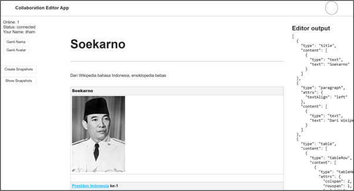
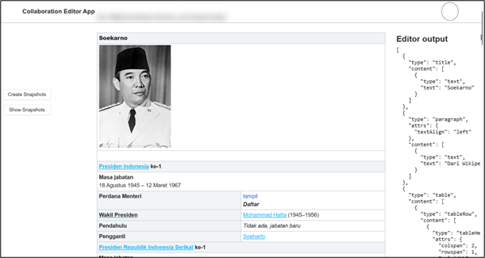
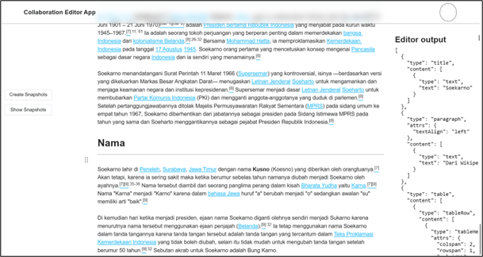
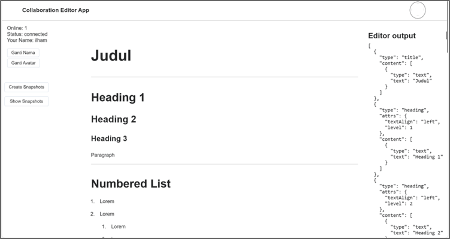
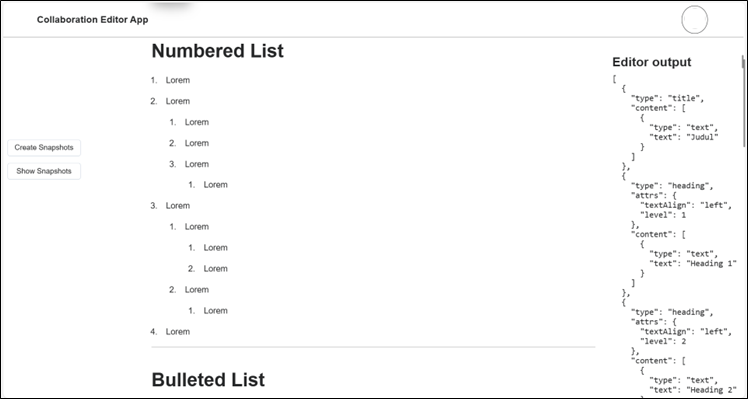
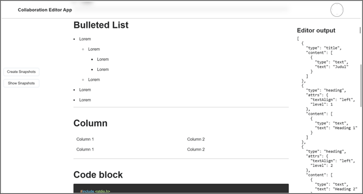
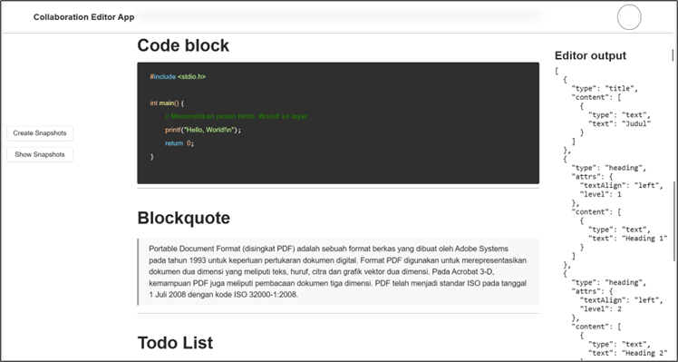
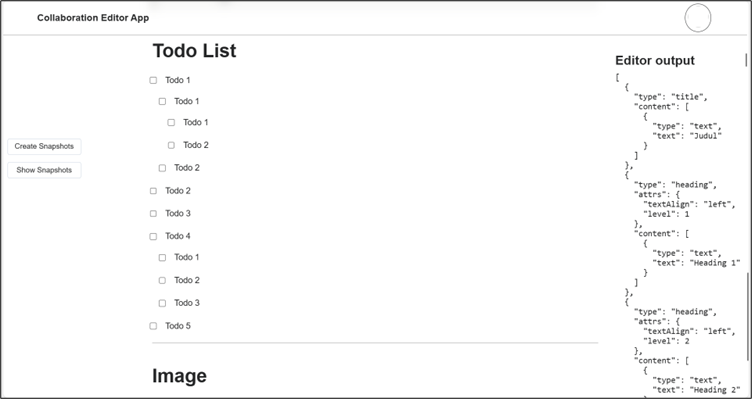
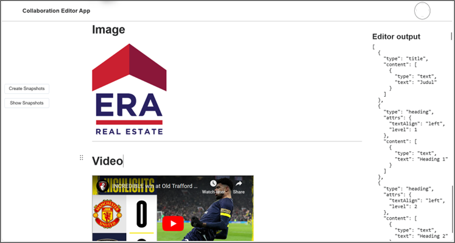
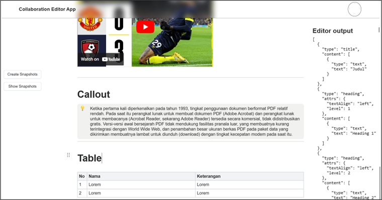
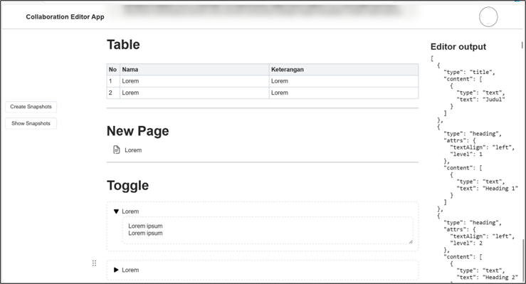
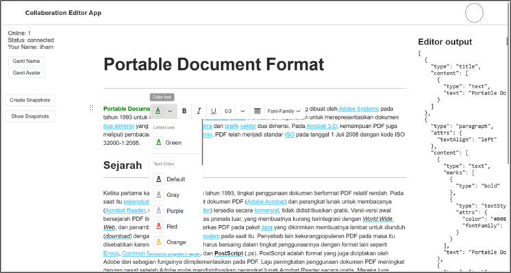
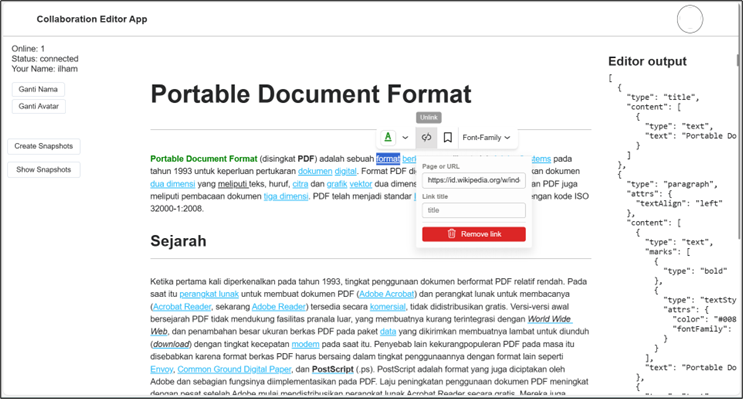
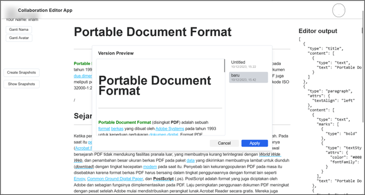


# Installation
> 💡 Package installer recommended [yarn](https://yarnpkg.com/)

1. Instal Dependency  
    ```bash
    yarn
    
    # npm install [if use npm]
    ```
    
2. Run Development Server  
    ```bash
    yarn serve
    
    # npm run serve [if use npm]
    ```
    
3. Build Project form Deployment  
    ```bash
    yarn build
    
    # npm run build [if use npm]
    ```
